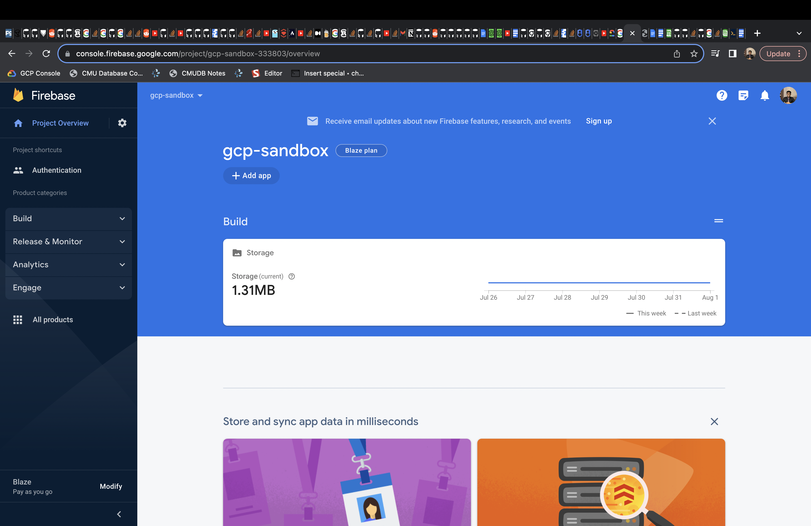

# Official involveMINT Web App Repository

## Setting Up Environment

Prerequisites:

- Node.js
- Docker

### Steps

1. Fork and clone this repository. Ensure that you uncheck the "copy main branch only" checkbox. Once you forked the repository, clone it to a directory on your local machine and `cd` into it.

2. Checkout the "develop" branch: `git checkout develop`.
3. Ensure you have Node.js installed. If you don't, please look at the section on [installing node.js](#installing-nodejs).
4. Ensure you have Docker installed. If you don't, please navigate to the [official website](https://docs.docker.com/get-docker/) and follow the instructions. Run `docker --version` in your terminal after it's installed to ensure you have installed everything correctly.

### Installing Node.js

Run the following commands.

1. `curl -o- https://raw.githubusercontent.com/nvm-sh/nvm/v0.39.1/install.sh | bash`
2. `export NVM_DIR="$([ -z "${XDG_CONFIG_HOME-}" ] && printf %s "${HOME}/.nvm" || printf %s "${XDG_CONFIG_HOME}/nvm")"`
3. `[ -s "$NVM_DIR/nvm.sh" ] && \. "$NVM_DIR/nvm.sh"`
4. Refresh your shell (close and reopen). If you're using zsh, here's a shortcut: `source ~/.zshrc`
5. If the following command does not throw an error, you're good so far: `nvm -v`
6. `nvm install --lts`
7. `nvm use --lts`

### Configuring Firebase

In order to run this code, you will need to navigate to [firebase](https://console.firebase.google.com/). You will see a screen that looks like  and click "Create a project" (if you don't already have a GCP account and an existing project where you want to use Firebase). Once you have a project, you should see a screen like . Once here, select the "Service accounts" tab and then hit the "Manage service account permissions" hyperlink which will take you to your GCP project. You will see a screen that looks like [this](/assets/gcp-service-accounts.png). Click the account and then hit the "Keys" tab. Click "Add Key" and then choose the "JSON" option to download it as a JSON file. 

Ensure you are in the project directory (the directory that this file is in). Run the following command: `cp libs/shared/domain/src/lib/environments/environment.ts libs/shared/domain/src/lib/environments/environment.prod.ts` and open the new file (environment.prod.ts) in your editor. It should look like this at first: 

Once here, navigate to the "Build" button on the right pane and select "Authentication" in the dropdown menu provided. Select "Email and Password" and hit save. 

export NODE_OPTIONS=--openssl-legacy-provider

<!-- 1. Clone repository -->
<!---->
<!-- ```sh -->
<!-- git clone git@ssh.dev.azure.com:v3/involvemint/involveMINT/involvemint2.0 -->
<!-- ``` -->
<!---->
<!-- 2. Change directory into repository -->
<!---->
<!-- ```sh -->
<!-- cd involvemint2.0 -->
<!-- ``` -->
<!---->
<!-- 3. Install dependencies -->
<!---->
<!-- ```sh -->
<!-- npm install -->
<!-- ``` -->
<!---->
<!-- 4. Start client -->
<!---->
<!-- ```sh -->
<!-- npx ng s -->
<!-- ``` -->
<!---->
<!-- 5. In another terminal, start server -->
<!---->
<!-- ```sh -->
<!-- npx ng s api -->
<!-- ``` -->
